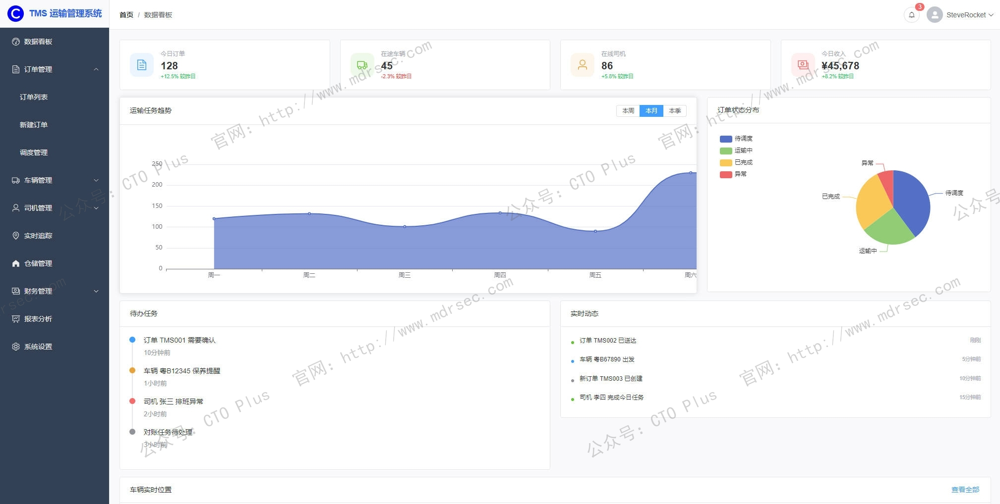
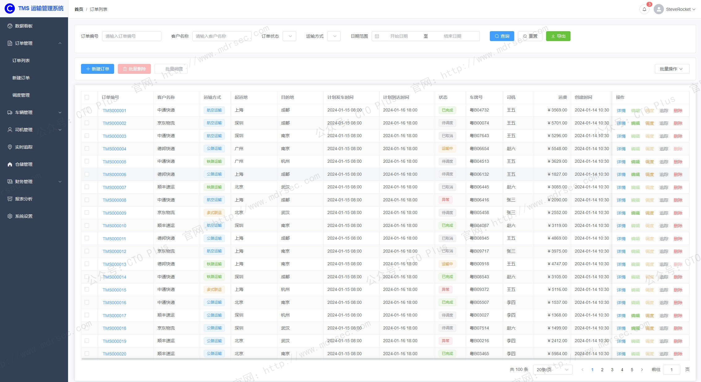
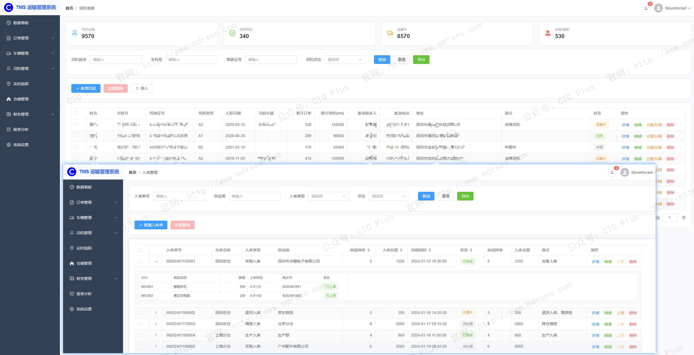
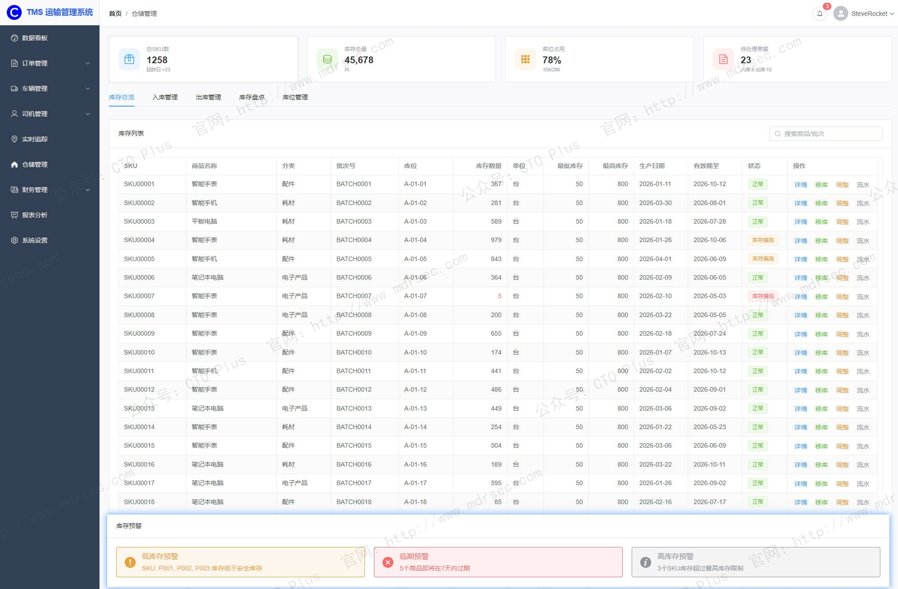
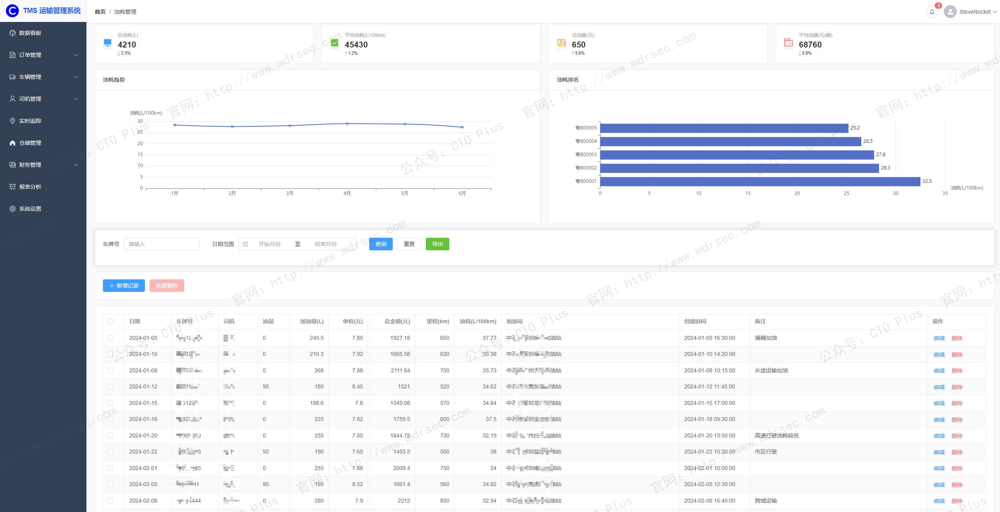
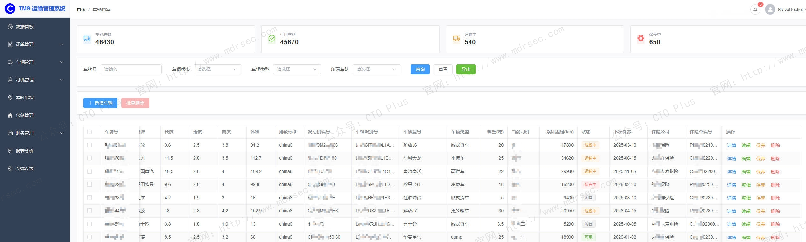
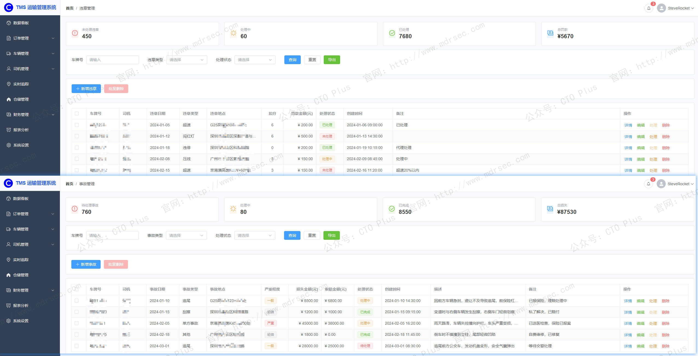

# 跨境电商物流运输管理系统（TMS）

## 关于我们

- 官网： http://www.mdrsec.com

我们的技术文章和产品概述欢迎浏览我们的门户。

- 公众号：CTO Plus

最新的动态欢迎关注我们官方唯一公众号。

- 作者QQ

更详细更具体的需求，或者项目合作，或者问题 欢迎联系我。

- QQ群

我们官方组建的QQ群，如果您有兴趣也可以加入我们。

- 请喝咖啡

如果感兴趣，也可以请我喝杯咖啡

## 产品核心功能模块

在全球供应链复杂度激增、消费者对交付时效愈发严苛的当下，企业运输管理系统（Transportation Management System，TMS）已从早期的“运输执行工具”进化为供应链数字化的中枢核心。作为连接货主、承运商、仓库与终端客户的核心平台，TMS承担着规划、执行、监控与优化货物物理移动的全链路职责。

根据Gartner发布的2025年运输管理系统魔力象限报告，以SAP为代表的头部厂商凭借执行能力与完整愿景持续领跑市场，这印证了TMS在企业供应链战略中的权重正在持续攀升。这里我将为大家介绍下我们TMS系统的一些核心功能，及其底层架构与技术特性，靠这些又是应如何支撑复杂的业务场景的。

## 核心功能模块

我们自研的企业级TMS通常围绕运输业务的时序逻辑——运前决策、运中执行、运后结算——构建功能矩阵。各模块既独立运作又环环相扣，共同形成运输管理的数字化闭环。

### （一）运前决策：规划与寻源的智能化

**1. 订单管理与标准化接入**

订单是运输业务的起点。TMS需具备多渠道订单自动汇集能力，通过API或EDI对接企业ERP、OMS、电商平台及客户门户，将不同格式的运输需求标准化为统一数据模型。订单信息涵盖发货方/收货方地址、货物明细（品名、数量、体积、重量）、时效要求、特殊属性（如温控、危化品标识）等关键字段。

我们自研的TMS还支持订单的智能审核与拆分策略：系统根据预设规则校验订单信息的完整性与合理性，对于大型项目订单或包含多个子任务的复杂需求，可自动拆分为多个可独立执行的运输任务，显著降低人工干预成本。

**2. 运输计划与路径优化**

这是我们TMS核心价值最集中的体现。系统基于订单属性与约束条件，调用路径优化引擎进行智能规划：

- **拼车与配载优化**：将多个顺路的小批量订单合并装载，最大化车辆容积率和载重利用率。某家电企业部署TMS后，车辆装载率从65%提升至89%。
- **路线规划**：综合考虑交通状况、限行政策、配送时间窗、车辆续航等因素，计算最优行驶路径。系统既支持固定路线模板（如按客户路线、邮区路线分类），也支持动态AI路线计算。
- **多式联运规划**：对于长距离或跨境运输，系统可设计“公路+铁路+海运+空运”的组合方案，在时效与成本间寻求最优平衡。

**3. 承运商寻源与智能匹配**

我们TMS内置承运商管理池，集中维护合作物流服务商的合同、服务线路、计费标准及历史绩效数据。当运输计划生成后，系统可自动执行比价与匹配策略：
- **合同运力匹配**：根据预设费率协议，优先匹配性价比最优的合同承运商。
- **动态询价比价**：向多个承运商发起线上询价，按“成本优先”“时效优先”等预设规则自动选定。
- **混合运力调度**：整合自有车队、合同运力与临时采购运力，应对季节性波峰与突发需求。

### （二）运中执行：监控与协同的实时化

**4. 调度指派与任务分发**

计划落实为执行指令的关键环节。调度员通过TMS将运输任务指派至具体车辆与司机，系统支持集中调度（跨区域统一分单）与区域中心调度（分区自治）两种模式，满足集团化管控与区域灵活执行的平衡需求。司机通过移动端App接收任务、确认装货、上报节点状态，全流程无纸化流转。

**5. 在途可视化与异常预警**

通过集成GPS、北斗定位模块及车载终端，TMS实现对运输车辆的实时位置追踪与轨迹回放。可视化能力不仅面向管理者，还可通过链接或小程序开放给货主自助查询，客服咨询量可因此下降40%。

异常管理是可视化能力的延伸：系统通过电子围栏、计划偏离检测、温控阈值监测等机制，主动识别延误、路线偏离、货厢温度异常等风险事件，触发分级预警并推送责任人介入。问题处理的平均响应时效可压缩至15分钟以内。

**6. 移动端协同与节点采集**

司机App是连接计划层与执行层的关键触点，承载以下核心功能：
- **任务接收与确认**：查看当日运输任务，确认装货明细。
- **节点打卡**：在装车、发车、到达、签收等关键节点扫码或定位打卡，形成完整的执行时间轴。
- **异常上报**：遇交通管制、车辆故障、客户拒收等情况时，实时拍照上传并备注说明。
- **电子回单**：签收时通过App采集签名与货物照片，生成具有法律效力的电子签收单（POD），加速回单流转与结算周期。

### （三）运后管理：结算与分析的数据化

**7. 计费引擎与自动结算**

运费结算是传统物流管理中效率洼地。企业级TMS内置多维度计费引擎，支持按重量、体积、里程、时效、车型、温区等15种以上计费因子的灵活组合，适配普货、冷链、危化品、大件等差异化计费场景。

结算流程高度自动化：系统根据运输任务的实际执行数据（如实际里程、签收数量）与合同费率，自动生成应付账单，并与承运商提交的账单进行自动比对稽核，标记差异项。与财务系统（如金蝶、用友、SAP FICO）深度集成后，对账效率可提升90%以上。

**8. 承运商绩效与KPI管理**

TMS沉淀的运输数据为承运商绩效评估提供了客观依据。系统可自定义KPI指标并自动生成考评报表，典型维度包括：
- **准时交付率**：按线路、区域、客户等维度统计。
- **破损率与货损赔付率**：关联异常上报记录与赔付金额。
- **运输成本达成率**：实际运费与计划成本的偏差。
- **响应时效**：从询价到接单的平均时长。

绩效数据反哺承运商寻源策略，形成“评估-优选-汰换”的管理闭环。

**9. 商业智能与决策支持**

数据资产的价值释放依赖BI能力的深度。企业级TMS提供可配置的驾驶舱与报表引擎，支持从订单、成本、时效、质量等多维度钻取分析。典型应用场景包括：区域运量热力图指导分仓选址、线路成本分析支撑运价谈判、承运商贡献度排名驱动资源倾斜。领先厂商已开始引入预测性分析，如基于历史货量预测未来运力需求，提前锁定资源。

具体功能欢迎联系我们咨询，欢迎合作🤝 http://www.mdrsec.com 官方出品

## 跨系统协同：TMS在供应链生态中的连接者角色

孤立运作的TMS价值有限。真正支撑企业供应链数字化升级的，是TMS与OMS、WMS、ERP等系统的深度协同。

### 与OMS（订单管理系统）的协同
OMS向TMS传递订单明细与履约要求（如时效等级、客户VIP标签），TMS据此匹配差异化运输方案。当TMS获取签收数据后，实时回传OMS触发订单完成与售后入口开启，形成“下单-履约-签收-服务”的端到端闭环。

### 与WMS（仓库管理系统）的协同
WMS完成拣货打包后，通过ASN（提前发货通知）向TMS推送包裹详情（重量、体积、温控要求）。TMS据此生成装车计划，指导仓库按“重货打底、轻货置顶”等规则装车，提升容积率约15%。在途状态（已发车、到达中转仓）亦实时回流至WMS，供客服与收货方查询。

### 与ERP的协同
ERP作为企业资源计划的核心，向TMS提供物料主数据、客户档案、成本中心等基础数据，并接收TMS回传的运输成本数据用于财务核算与利润分析。部分深度集成场景中，TMS的运单可直接触发生成ERP中的销售出库单与应付凭证。

## 功能模块

包括的功能模块如下：

- 车辆管理 - 车辆的增删改查、批量操作
- 保养管理 - 保养记录、提醒、计划
- 油耗管理 - 油耗记录、统计、排名
- 保险管理 - 保险信息、理赔、到期提醒
- 年检管理 - 年检记录、提醒
- 费用管理 - 成本统计、效益分析
- 驾驶员关联 - 分配/解除驾驶员、历史记录
- 文件管理 - 图片上传、文档管理
- 数据导入导出 - Excel导入导出、模板下载
- 报表统计 - 运营报表、效率分析
- 车辆调度 - 调度状态、任务管理、排班
- 维保计划 - 计划创建、执行、提醒
- 档案管理 - 变更历史、审核流程
- 报废管理 - 申请、审核、执行
- 租赁管理 - 租赁记录、结束租赁
- 违章管理 - 违章记录、处理
- 事故管理 - 事故记录、资料上传
- 通知提醒 - 系统通知、自定义提醒

## 技术架构与特性：SaaS化、平台化与智能化

功能之上，技术架构决定了TMS的扩展性、安全性与演进潜力。我们的企业级TMS能满足不同用户的需求环境：

首先我们的TMS支持本地化部署

**1. 云原生与SaaS部署**
相较于传统本地化部署，云TMS（SaaS模式）在部署周期、运维成本与迭代速度上具有显著优势。多租户架构为每个企业分配独立运行空间，既保证数据隔离与安全，又实现了底层资源的弹性伸缩。网络传输采用HTTPS加密通道，数据存储采用主从备份与异地灾备策略，满足企业级安全合规要求。

**2. 高扩展性与集成能力**
企业级TMS需应对多业态、多区域的复杂业务场景，对扩展性提出高要求：
- **模块化按需启用**：支持订单管理、调度、计费等核心模块的灵活组合，避免“一刀切”部署带来的功能冗余。
- **开放API与EDI对接**：提供标准API接口与预置连接器，快速对接主流ERP、WMS、电子面单平台及承运商系统。部分平台已实现与SAP、Oracle等头部系统的开箱即用集成。

**3. 权限与管控的粒度细分**
集团型企业要求总部统一管控、区域灵活执行的平衡。TMS需支持字段级权限配置，不同角色（调度员、财务、承运商、司机）仅可见其职责范围内的数据与操作入口。总部可统一制定分单规则、计费模型与承运商准入标准，分公司在授权范围内独立执行。

**4. AI与智能算法的渗透**
从“辅助决策”到“自主决策”是TMS智能化的演进方向：
- **动态路径优化**：融合实时路况与历史数据，动态调整在途路线。
- **预测性ETA**：基于机器学习修正预计到达时间，精度持续收敛。
- **智能承运商推荐**：综合成本、时效、质量三维度，为每笔订单推荐最优承运方案。
- **异常自愈**：当系统检测到车辆偏离路线或即将延误时，自动触发备用方案（如改派车辆、通知客户）。

## 最后

我们的企业级TMS系统其价值远不止于“把货从A点送到B点”。它通过订单标准化、规划智能化、执行可视化、结算自动化与决策数据化，将运输管理从离散的人工操作升维为可量化、可预测、可优化的数字化能力。

在选型实践中，企业应重点考察三项核心能力：其一，功能覆盖是否完整，能否支撑从订单到结算的全程闭环；其二，集成能力是否开放，能否与企业现有ERP、WMS生态无缝对接；其三，架构是否具备弹性，能否伴随业务规模扩张与模式演进持续迭代。

当TMS真正融入企业供应链体系，它便不再只是一个软件系统，而是支撑韧性增长的战略资产——短期实现物流成本20-30%的优化，长期构建敏捷、透明、可持续的供应链竞争力。

具体功能欢迎联系我们咨询，欢迎合作🤝 http://www.mdrsec.com 官方出品

## 产品清单

### 企业网络安全运营中心产品

- 资产安全配置管理系统（SCMDB）
- 终端侦测与响应系统（EDR）
- 网络侦测与响应系统（NDR）
- 企业网络资产攻击面管理系统（CAASM）
- 资产暴露面管理系统（AEMS）
- 网络安全蜜罐管理系统（HoneyPot）
- 安全事件收集与告警管理系统（SIEM）
- 扩展侦测与响应系统（XDR）
- 多引擎脆弱性扫描系统（VAS）
- 多源日志审计监测系统（LAS）
- 网络安全威胁情报中心（TIS）
- 网络安全漏洞库管理系统（VDBS）
- 网络安全编排与自动化响应（SOAR）
- 威胁狩猎系统（THS）
- 数据库安全审计系统（DSAS）
- AI智能体安全态势管理系统（AISPM）
- Web防火墙（WAF）
- 网站安全监测平台（WSM）
- 网络安全态势感知平台（SSAP）
- 网络安全自动化应急响应工具系统（NSRT）
- 企业网络安全运维工具系统（SecTools）
- 网络安全自动化等保测评系统（ASES）
- 浏览器安全监测防护系统（BSMPS）
- 网络安全用户实体行为分析系统（UEBA）
- 互联网电信诈骗预警防护系统（TPFWS）
- 云原生安全管理平台（CNAPP）
- 自动化渗透测试系统（PTS）
- 工业企业信息安全监测中心（IoT SOC）
- 企业智能安全运营中心（AISOC）

### 企业自动化运维产品

- 运维智能监控告警管理平台（AIMAMS）
- 企业网络工具系统（NTools）
- 自动化测试系统（AutoTest）
- 自动化运维系统（AutoOps）
- 企业运维工具系统（OpsTools）
- 物联网管理系统（IoTS）
- 软件开发生命周期管理系统（SDLC）
- IT流程管理系统（ITSM）

### 企业数字化运营资源管理系统产品

- 制造执行管理系统（MES）
- 跨境电商物流运输管理系统（TMS）
- 跨境电商企业资源管理系统（ERP）
- 企业客户关系管理系统（CRM）
- 跨境电商仓库管理系统（WMS）
- 财务管理系统（FMS）
- 质量管理系统（QMS）
- 精准营销管理系统（PMS）
- 智能生产管理系统（SPMS）
- 电商BI系统（BI）
- 智能互联网分布式爬虫系统（AISpider）
